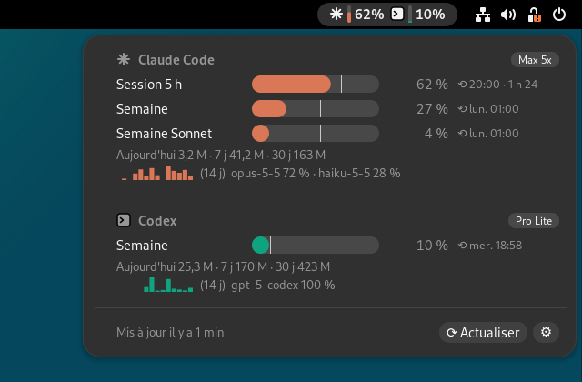
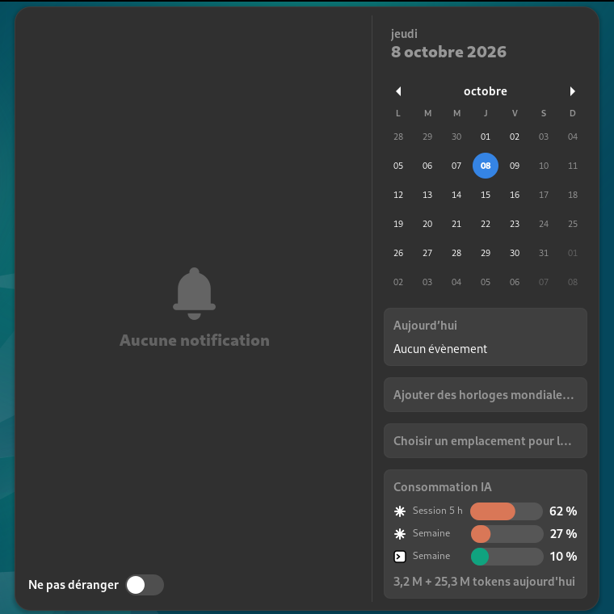

# ai-usage-widget

See your Claude Code and Codex CLI token usage and subscription quota windows
(5 h / weekly) in the GNOME top bar and the date menu, with threshold notifications.





*Screenshots use synthetic data from `docs/examples/state.example.json`.*

## Features

- **Top-bar chips**: one per provider, showing the binding quota (highest window %)
  with a mini vertical gauge. Position (left / centre / right) and label
  (percent, tokens, or both) are configurable.
- **Popup**: per-window bars with a pace tick (where you would be on a linear
  burn), reset times, today / 7-day / 30-day token totals, a 14-day sparkline and
  the top models.
- **Date-menu card**: the two most relevant windows per provider and today's
  token totals, under the calendar.
- **Threshold notifications**: warn (default 80 %) and critical (default 95 %),
  each fired once per quota window reset.
- **Read-only, local-first**: the collector parses local usage logs; the only
  network call is an optional, rate-limited read of Claude's plan usage (see
  [Data sources and privacy](#data-sources-and-privacy)).

## How it works

```
 ~/.codex/sessions, ~/.claude/projects        api.anthropic.com/api/oauth/usage
              │  (usage counters only)                 │  (≤ 1 GET / 5 min, optional)
              ▼                                        ▼
   systemd --user timer ─► collector (python3 -m ai_usage collect, every 60 s)
                                   │
                                   ▼  $XDG_RUNTIME_DIR/ai-usage/state.json
   GNOME Shell extension ◄── Gio.FileMonitor ── top bar · popup · date menu · notifications
```

The collector is a short-lived `oneshot` service run by a systemd user timer, not
a daemon. The GNOME extension only reads the JSON file it writes. Details and
design decisions: [docs/ARCHITECTURE.md](docs/ARCHITECTURE.md).

## Requirements

- **GNOME Shell 43 exactly**. This extension uses the legacy (pre-ESM) extension
  API; GNOME 45+ is not supported yet.
- Python **3.11 or newer** (standard library only; nothing to `pip install`).
- A systemd **user session** (the default on Debian/Ubuntu GNOME desktops).
- `glib-compile-schemas` (package `libglib2.0-bin` on Debian).
- At least one of: **Claude Code** (writes `~/.claude/projects`) or
  **Codex CLI** (writes `~/.codex/sessions`).

Tested target: Debian 12, GNOME Shell 43.9 on X11. Wayland works in principle
(log-out/log-in is needed to reload the shell) but is not part of the test matrix.

## Install

```bash
git clone https://github.com/hades-x/ai-usage-widget
cd ai-usage-widget
make install
```

Run these as your desktop user, not as root (the scripts refuse root).

`make install` copies the collector to `~/.local/share/ai-usage/`, installs and
starts the systemd user timer, and copies the extension to
`~/.local/share/gnome-shell/extensions/ai-usage@hades-x.github.io/`.

Then reload GNOME Shell so it loads the extension:

- **X11**: press `Alt+F2`, type `r`, press Enter.
- **Wayland**: log out and log back in.

Enable the extension:

```bash
gnome-extensions enable ai-usage@hades-x.github.io
```

If you previously installed the pre-release extension under `ai-usage@hades.local`,
the install script removes that copy during migration. Disable it if it is still
listed: `gnome-extensions disable ai-usage@hades.local`.

## Update

```bash
cd ai-usage-widget
git pull
make install
```

Reload the shell (see above) if the extension code changed.

## Uninstall

```bash
make uninstall
```

This disables and removes the timer and units, the installed collector, the
extension copy, the runtime state (`$XDG_RUNTIME_DIR/ai-usage`) and the cache
(`~/.cache/ai-usage`). Your Claude Code and Codex logs are never touched.

## Configuration

Open the preferences with the `⚙` button in the popup, or with
`gnome-extensions prefs ai-usage@hades-x.github.io`.

Settings are stored in dconf under `/org/gnome/shell/extensions/ai-usage/`
(schema `org.gnome.shell.extensions.ai-usage`). You can change them from the
command line, for example:

```bash
gsettings set org.gnome.shell.extensions.ai-usage warn-threshold 75
```

| Key | Type / values | Default | Meaning |
|---|---|---|---|
| `panel-position` | `left` \| `center` \| `right` | `right` | Where the indicator sits in the top bar |
| `panel-mode` | `percent` \| `tokens` \| `both` | `percent` | Top-bar label: quota %, today's tokens, or both |
| `show-in-panel` | bool | `true` | Show the top-bar indicator |
| `show-in-datemenu` | bool | `true` | Show the card in the date menu |
| `show-claude` | bool | `true` | Show the Claude Code section |
| `show-codex` | bool | `true` | Show the Codex section |
| `notify-enabled` | bool | `true` | Threshold notifications |
| `warn-threshold` | int, 1–100 | `80` | Warning threshold (%) |
| `crit-threshold` | int, 1–100 | `95` | Critical threshold (%) |
| `state-path` | string | `''` | Path to `state.json`; empty = `$XDG_RUNTIME_DIR/ai-usage/state.json` |
| `notified-keys` | string array | `[]` | Internal: notifications already sent. Do not edit |

## Data sources and privacy

**What is read**

- **Codex**: `~/.codex/sessions/**/*.jsonl` and `~/.codex/archived_sessions/**`
  (honours `$CODEX_HOME`). From each usage record the collector keeps only the
  token counters, the response id used for de-duplication, the model name, the
  timestamp and the rate-limit fields the CLI already records.
- **Claude Code**: `~/.claude/projects/**/*.jsonl` (honours `$CLAUDE_CONFIG_DIR`).
  Same rule: only the `message.usage` counters, message/request ids, model and
  timestamp.
- **Claude credentials** (only if the plan API is enabled): the access token in
  `~/.claude/.credentials.json`, read in memory.

Message and prompt content is never parsed or stored.

**What leaves the machine**

- Nothing, except at most one HTTPS `GET` to `https://api.anthropic.com/api/oauth/usage`
  every 5 minutes (with backoff on errors), sent with the existing Claude Code OAuth
  token. The call is read-only: the token is never refreshed, never logged and never
  written to disk. The response is cached in `~/.cache/ai-usage/claude_usage.json`
  without the token.
- Codex quota data comes from local logs only. The widget makes no Codex network calls.

**Turning the Claude plan call off**

The collector accepts `--no-api`. To set it on the systemd service, create a drop-in:

```bash
systemctl --user edit ai-usage-collector.service
```

and add:

```ini
[Service]
ExecStart=
ExecStart=/usr/bin/python3 -m ai_usage collect --no-api
```

Then run `systemctl --user daemon-reload`. With `--no-api`, the Claude section
shows only local-log token totals, with no plan percentages.

**Network listeners**: none. The extension and the collector do not open any port.

## Limitations and disclaimers

- The Claude usage endpoint (`/api/oauth/usage`) is **undocumented**. It may change or be removed
  without notice, in which case the widget falls back to stale values with an error notice.
- Codex quota is only as fresh as your last Codex request. The CLI writes rate-limit
  data only when it talks to the service.
- If Claude Code is logged out or its token has expired, the widget keeps the last
  good values and marks them stale, with a notice telling you to run `claude`.
- No cost (USD) estimation: model prices are not included.
- This project is **not affiliated with, endorsed by, or sponsored by Anthropic or
  OpenAI**. "Claude" is a trademark of Anthropic, PBC; "Codex" and "OpenAI" are
  trademarks of OpenAI. The icons are generic shapes, not their logos.

## Troubleshooting

```bash
# Timer and last run
systemctl --user status ai-usage-collector.timer
journalctl --user -u ai-usage-collector -n 20

# Collector diagnostics (sources found, indexed files, credentials state, API cache). No secrets.
PYTHONPATH=~/.local/share/ai-usage/collector python3 -m ai_usage doctor
PYTHONPATH=~/.local/share/ai-usage/collector python3 -m ai_usage print

# Extension errors (GNOME Shell logs go to the system journal)
journalctl _COMM=gnome-shell -b | grep -i ai-usage
```

Common states:

| Shown in the widget | Meaning | Fix |
|---|---|---|
| `—` chip, no state | No `state.json` yet | `systemctl --user start ai-usage-collector.service` |
| `Claude Code non configuré sur ce poste` | No credentials file | Install and log in to Claude Code |
| `Claude Code déconnecté — lance « claude » puis /login` | Logged out | Run `claude`, then `/login` |
| `Token expiré — lance « claude » pour le rafraîchir` | Token expired | Run `claude` to refresh it |
| `Limite d'appels API — nouvel essai plus tard` | HTTP 429 from the plan endpoint | Wait; the collector backs off automatically |

## Development

```bash
make test              # both suites
make test-collector    # python3 -m unittest discover -s collector/tests -v   (Python 3.11+)
make test-extension    # node extension/tests/run.js                          (Node 18+)
```

Headless GNOME Shell smoke test (screenshots, probes, prefs):

`tools/headless/run-headless.sh <repo> <state.json> <out_dir>` starts a headless
`gnome-shell` 43 on a virtual monitor. **Run it only as a dedicated, unprivileged
test user, never in your desktop session.** The script installs the extension
into that account's data directory, changes that account's dconf settings and
writes a `state.json` under its `$XDG_RUNTIME_DIR`. It only refuses one specific
account name, so the isolation is your responsibility. See the header comment of
the script for details.

Contribution rules: [CONTRIBUTING.md](CONTRIBUTING.md) and [AGENTS.md](AGENTS.md).
Security reports: [SECURITY.md](SECURITY.md).

## License

[MIT](LICENSE) © Alexis fts
